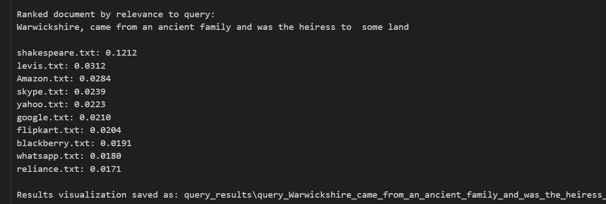

# Vector Space Model Implementation

**🔗 GitHub Repository:** [https://github.com/aarushroyy/IR-Vector-Space-Model](https://github.com/aarushroyy/IR-Vector-Space-Model)

## Project Summary

This is our implementation of a Vector Space Model for Information Retrieval as part of Lab Assignment 1. The system indexes a corpus of 40+ documents and allows users to search through them using tf-idf weighting and cosine similarity. We've built an interactive search system that not only returns ranked results in console as results but also generates visual charts showing document relevance scores.

## Team Members

| Name | Roll Number | 
|------|-------------|
| **Aarush Roy** | 2210110102 | 
| **Atharva Parashar** | 2310110442 | 
| **Tanya V Edlyn** | 2210110617 | 

## How We Implemented It

### Text Preprocessing
Implemented a preprocessing pipeline that handles:
- Converting text to lowercase and removing special characters
- Tokenization using NLTK's word tokenizer
- Removing English stopwords 
- Lemmatization and stemming to normalize words
- **Soundex encoding** for phonetic matching (helps with misspelled queries)

### Vector Space Model
Our implementation follows the **lnc.ltc** ranking weighting scheme:
- **For queries**: log term frequency × IDF × cosine normalization
- **For documents**: log term frequency × no IDF × cosine normalization

We calculate cosine similarity between query and document vectors to rank documents by relevance.

### Additions
- **Error handling**: Prevents division by zero errors when query/document vectors are empty
- **Data Visualisation**: Visualised charts for all queries generated automatically
- **Interactive interface**: Simple command-line interface for real-time searching

## How to Run

1. Install required packages:
```bash
pip install nltk matplotlib
```

2. Open `vector_space_model.ipynb` in Jupyter Notebook

3. Run all cells to initialize the system and start the interactive search

4. Enter your queries when prompted, type 'exit' to stop

## Sample Queries to Test

Try these queries to see how well our system works:

**Query 1:** `apple computer technology`
Expected to return Apple, Adobe, Operating, Microsoft documents

## Output Screenshots

### Console Output Example
```
Enter your query (exit to end): apple computer technology

Ranked document by relevance to query: 
apple computer technology

apple.txt: 0.1667
Adobe.txt: 0.1342
operating.txt: 0.1270
...

Results visualization saved as: query_results/query_apple_computer_technology_20250922_143052.png
```

### PNG Visualization Examples
The system automatically generates horizontal bar charts showing:
- Top 10 most relevant documents
- Cosine similarity scores for each document
- Query text in the title
- Timestamp of when the search was performed

Charts are saved in the `query_results/` directory with descriptive filenames.

#### Test Query Results

**Query 1: Zomato Business Query**


**Query 2: Shakespeare Text Query**


**Query 3: Apple Computer Technology Query**
 